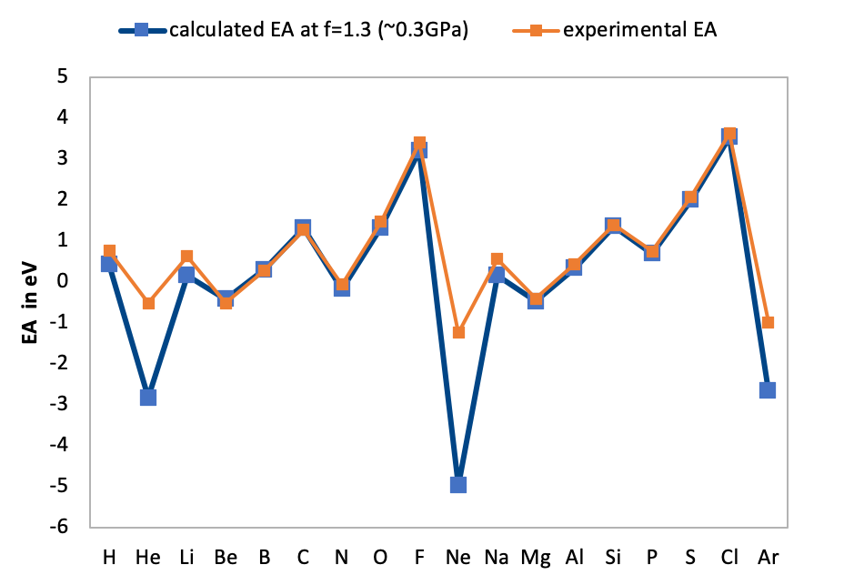
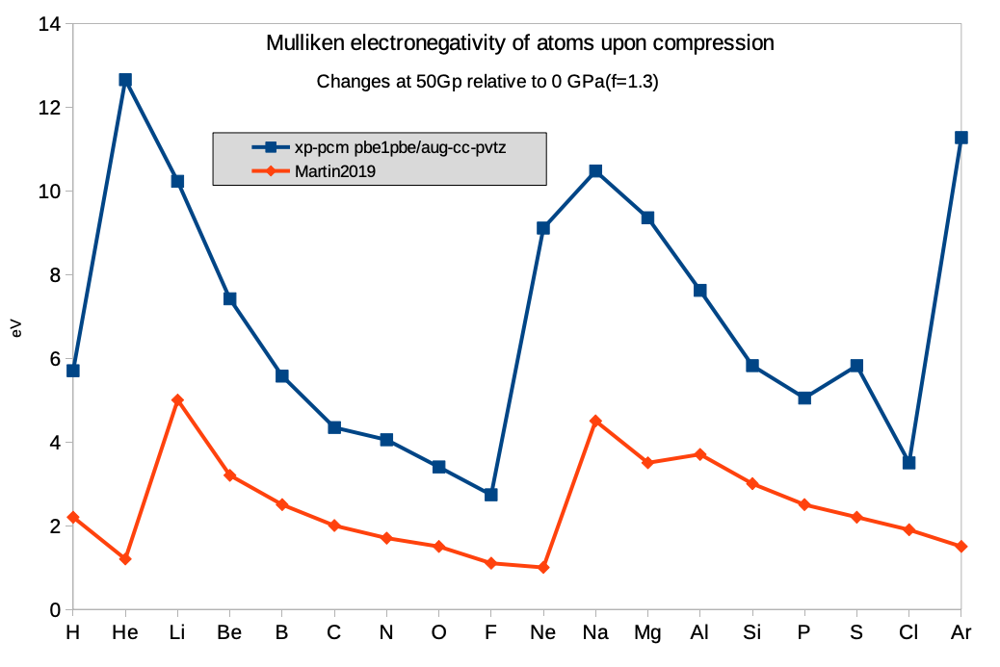

# Downloading and installing Julia

https://julialang.org/downloads/

Use the latest version. Run the following commands to download and extract the julia package on Linux:

``` bash
wget https://julialang-s3.julialang.org/bin/linux/x64/1.5/julia-1.5.2-linux-x86_64.tar.gz

tar -xzvf julia-1.5.2-linux-x86_64.tar.gz
```

Add julia to PATH (replace "pathtojulia" in the following command with the actual path on your machine):

``` bash
export PATH=/pathtojulia/julia-1.5.2/bin:$PATH
```

# Installing the LsqFit package

In your terminal, type `julia`, which will open the julia REPL, and and in the PEPL, type

``` julia
using Pkg
Pkg.add("LsqFit")
```

The installation of the LsqFit package may take a while. After installing the LsqFit package, run the following command to test if it is working:

``` julia
using LsqFit  # this may take >1 minute to load

xdata = [ 1.0
        0.9410359787896052
        0.892747272010167
        0.8440028046803102
        0.7944607563872212
        0.768315877119944
        0.7444147421008809]

ydata = [ 0.0
        0.002892932000008841
        0.007156206999979986
        0.012909014999991086
        0.020529311000018424
        0.025222962999976062
        0.03096462100000963]

p0 = [0.0, 5.0, 0.0]

@. model(x, p) = (p[1]/p[2])*x^(-p[2]) + (p[1]-p[3])*x

fit = curve_fit(model, xdata, ydata, p0)

print(fit.param)
```

The last command should print an array of 3 floating numbers:

``` julia
[0.04396688697055344, 4.864867834353412, 0.0533354593802239]
```

You may exit the julia REPL using

``` julia
exit()
```

# Running XP-PCM calculations

Copy `xppcm-molecule.jl` and `input.jl` to a working folder. The input file `input.jl`, in which the calculation parameters are specified, is in the format of the Julia programming language. The script `xppcm-molecule.jl` will read those parameters before running the XP-PCM calculation. Modify `input.jl` according to the instructions in the file. 

Make sure Gaussian09 or Gaussian16 is properly installed, and the command `g09` or `g16` will actually call the program. The script will use `g16` over `g09` if both are installed. 

Then use the following command (4 cpu cores/threads are assigned) to run an XP-PCM calculation:

``` bash
julia --threads 4 xppcm-molecule.jl
```

Below is an example PBS script for running XP-PCM calculations on a cluster. Modify the PBS script according your cluster specifications. Important thing is to let the computing node know the paths to `g09`/`g16` and `julia`.

``` pbs
#!/bin/bash
#PBS -q parallel
#PBS -l nodes=1:ppn=4
#PBS -l mem=8gb
#PBS -l cput=24:00:00 
#PBS -N xppcm

cd $PBS_O_WORKDIR

module load Gaussian/16

/scratch/user/julia-1.5.1/bin/julia --threads 4 xppcm-molecule.jl
```

The output will be printed to the `properties.dat` file when the calculation is finished.

# Calculating IP and EA at high pressure

## Prepare the input file

Let's use the Helium atom as an example. First, give the xyz coordinate in `input.jl`, as one would do for a normal Gaussian calculation, but here in the geometry block with triple quotation marks.

``` julia
# Keep the coordinates (in Angstrom) within the triple """ block.
# Do not include comments or other text in the """ block.
# Blank lines and spaces are ok.
geometries = """

H 0.0 0.0 0.0

"""
```

Then, modify the Gaussian parameters as needed, such as the functional/basis set, charge, and multiplicity

``` julia
# Gaussian 09/16 parameters
nproc = 1
mem = "1gb"
keywords = "pbe1pbe/aug-cc-pvtz scf=(Damp,fermi,conver=6)int=finegrid"    # Gaussian keywords; add more if needed
charge = 0
multiplicity = 2
```

Finally, modify the XP-PCM parameters as necessary. If not sure, use the default.

``` julia
# Only "cyclohexane", "benzene", and "argon" are currently implemented
solvent = "cyclohexane"

# The default dielectric permittivity of the solvent may be set close to 1
# for calculations on charged systems. Comment it out to use the default value.
dielectric = 1.0025

# Choose either the Bondi or Rahm vdW radii and the corresponding set of 
# scaling factors
#radiustype = "bondi"
#scalingfactors = [1.2, 1.15, 1.1, 1.05, 1.0, 0.975, 0.95]
radiustype = "rahm"
scalingfactors = [1.3, 1.25, 1.2, 1.15, 1.1, 1.05, 1.0, 0.975, 0.95, 0.925, 0.90]

# The mean area in Ang^2 of the tesserae by which the surfaces of the cavity
# is partitioned. Suggested value = 0.075.
tesserae = 0.075

# Empirical Pauli repulsion parameter; recommended values: 3, 6 or 9
# Larger 𝜂 leads to higher calculated pressures
𝜂 = 6
```

## Run the calculations for the neutral and cation

Right now the input filename `input.jl` is hard-coded. If the filename is changed, the script will not work. 

So if we want to calculate both the neutral and the cation, we may 1) use separate folders for each species and copy the script and input file to each folder, or 2) calculate the neutral first, rename its output file, and then calculate the cation.

I will use the second approach here.

``` julia
# first calculation for the neutral
julia xppcm-molecule.jl
mv properties.dat H.dat
# modify the change and multiplicity in input.jl
julia xppcm-molecule.jl
mv properties.dat H+.dat
```

## Understanding the output

The XP-PCM calculation will generate two Gaussian input files (`Vc.gjf` and `Ger.gjf`) and correspondingly two Gaussian output files (`Vc.log` and `Ger.log`). A third output file is the `properties.dat` file that contains the xppcm results in a tabular form, and the orbital energies extracted from `Ger.log` without additional munipulation.

- 𝑓 is the scaling factor for the vdW radii
- 𝐺𝑒𝑟 is the energy in a.u. (hartree)
- 𝑝 is the pressure in GPa

```
#    𝑓       𝑉𝑐(𝑓) ų   𝑠(𝑓)        𝜀(𝑠)        𝑍(𝑠)        𝐺𝑒𝑟(𝑓) a.u.  𝑝(𝑓) GPa
1    1.30    33.611    1.000000    1.002500    0.778100    -0.50064868    0.605
2    1.25    29.880    0.961538    1.002812    1.107485    -0.50029183    0.886
3    1.20    26.436    0.923077    1.003179    1.599162    -0.49967170    1.378
4    1.15    23.267    0.884612    1.003611    2.345625    -0.49859023    2.260
5    1.10    20.362    0.846148    1.004127    3.499600    -0.49670410    3.881
6    1.05    17.710    0.807692    1.004745    5.318927    -0.49343167    6.943
7    1.00    15.299    0.769238    1.005492    8.250696    -0.48782262   12.909
8    0.97    14.180    0.750006    1.005926   10.362177    -0.48370646   17.853
9    0.95    13.117    0.730776    1.006406   13.091101    -0.47840695   24.928
10   0.93    12.108    0.711536    1.006940   16.644183    -0.47163473   35.153
11   0.90    11.153    0.692314    1.007534   21.296322    -0.46306111   50.058

𝑓 = 1.30    𝑝 =  0.605 GPa ----orbital energies in a.u.----
 Alpha  occ. eigenvalues --   -0.33424
 Alpha virt. eigenvalues --    0.04595   0.13452   0.13452   0.13452   0.26293
 Alpha virt. eigenvalues --    0.68687   0.68687   0.68687   0.68690   0.68690
 Alpha virt. eigenvalues --    0.82876   0.82876   0.82876   0.85799   2.67715
 Alpha virt. eigenvalues --    3.56037   3.56037   3.56037   3.56037   3.56037
 Alpha virt. eigenvalues --    3.73019   3.73019   3.73019   5.18807
  Beta virt. eigenvalues --   -0.01906   0.09190   0.22903   0.22903   0.22903
  Beta virt. eigenvalues --    0.36905   0.80335   0.80335   0.80335   0.80337
  Beta virt. eigenvalues --    0.80337   0.99548   0.99548   0.99548   1.00938
  Beta virt. eigenvalues --    2.89616   3.76606   3.76606   3.76606   3.76607
  Beta virt. eigenvalues --    3.76607   3.98265   3.98265   3.98265   5.41091

  ...

```

Let's compare the XP-PCM results of the neutral and the cation. The scaling factors 𝑓 and 𝑠, volume 𝑉𝑐, dielectric constant 𝜀, Pauli repulsion barrier 𝑍 are the same for both species, because these parameters are based on the same atomic radius, scaling factors and solvent properties.

The energy 𝐺𝑒𝑟 and pressure 𝑝 are different for the two species at the same scaling factor. The neutral helium atom has one more electron than the cation, and its electron density is more diffuse than the cation, which leads to a stronger repulsion exerted by the solvent continuum and thus a higher pressure for the neutral.

```
# The neutral H
#    𝑓       𝑉𝑐(𝑓) ų   𝑠(𝑓)        𝜀(𝑠)        𝑍(𝑠)        𝐺𝑒𝑟(𝑓) a.u.  𝑝(𝑓) GPa
1    1.30    33.611    1.000000    1.002500    0.778100    -0.50064868    0.605
2    1.25    29.880    0.961538    1.002812    1.107485    -0.50029183    0.886
3    1.20    26.436    0.923077    1.003179    1.599162    -0.49967170    1.378
4    1.15    23.267    0.884612    1.003611    2.345625    -0.49859023    2.260
5    1.10    20.362    0.846148    1.004127    3.499600    -0.49670410    3.881
6    1.05    17.710    0.807692    1.004745    5.318927    -0.49343167    6.943
7    1.00    15.299    0.769238    1.005492    8.250696    -0.48782262   12.909
8    0.97    14.180    0.750006    1.005926   10.362177    -0.48370646   17.853
9    0.95    13.117    0.730776    1.006406   13.091101    -0.47840695   24.928
10   0.93    12.108    0.711536    1.006940   16.644183    -0.47163473   35.153
11   0.90    11.153    0.692314    1.007534   21.296322    -0.46306111   50.058

# THe cation H+
#    𝑓       𝑉𝑐(𝑓) ų   𝑠(𝑓)        𝜀(𝑠)        𝑍(𝑠)        𝐺𝑒𝑟(𝑓) a.u.  𝑝(𝑓) GPa
1    1.30    33.611    1.000000    1.002500    0.778100    -0.00032938   -0.066
2    1.25    29.880    0.961538    1.002812    1.107485    -0.00038534   -0.081
3    1.20    26.436    0.923077    1.003179    1.599162    -0.00045335   -0.102
4    1.15    23.267    0.884612    1.003611    2.345625    -0.00053745   -0.133
5    1.10    20.362    0.846148    1.004127    3.499600    -0.00064146   -0.178
6    1.05    17.710    0.807692    1.004745    5.318927    -0.00077211   -0.246
7    1.00    15.299    0.769238    1.005492    8.250696    -0.00093778   -0.350
8    0.97    14.180    0.750006    1.005926   10.362177    -0.00103771   -0.423
9    0.95    13.117    0.730776    1.006406   13.091101    -0.00115078   -0.513
10   0.93    12.108    0.711536    1.006940   16.644183    -0.00127908   -0.628
11   0.90    11.153    0.692314    1.007534   21.296322    -0.00142633   -0.774
```

The vertical IP can be calculated by taking the energy difference between the neutral and the cation Ger(cation)-Ger(neutral) at the same scaling factor.

```
#p/GPa      IP/eV      EA/eV      
0.605      13.6144      0.418942  
0.886      13.6032      0.320166  
1.378      13.5844      0.169439  
2.260      13.5527      -0.0604011
3.881      13.4986      -0.408699 
6.943      13.406      -0.928894  
12.909      13.2488      -1.68747 
17.853      13.1341      -2.17955 
24.928      12.9868      -2.76017 
35.153      12.799      -3.44031  
50.058      12.5617      -4.23054 
```

IP decreases as the pressure increases. The reason is that at high pressure, the valence electrons in the neutral H atom experiences a stronger repulsion than at low pressure; consequently it is easier to remove one valence electron from H at high pressure than at low pressure.

Similarly, vertical EAs can be calculated by taking the energy differences between the neutral and the anion Ger(neutral)-Ger(anion) at the same scaling factors. Negative EA indicates destabilization when one electron is added to the neutral. 

# Testing calculations for H to Ar

The figure below shows the calculated EAs of H through Ar at PBE0/aug-cc-pVTZ level by XP-PCM at scaling factor f=1.3, which on average corresponds to about 0.3 GPa for all the calculated atoms. The agreement with the experimetnal EA values (~0 GPa) is good except for the Noble gas elements. We did not investigate why the computed EAs for the Noble gas elements are too negative compared with the experimental values, but it is unlikely due to the XP-PCM methodology. One may try other functional or basis set to see if there is any improvement.



The figure below Changes of Mulliken electronegativities of atoms at ~50 GPa (f=0.9), relative to those at ~0.3 GPa (f =1.3), calculated at the pbe1pbe/aug-cc-pvtz level. Comparison was made to the changes of Allen electronegativity in the same pressure range from the Martin Rahm 2019 paper. If we ignore the Noble gas elements, the general trend of the two curves are very similar. 

